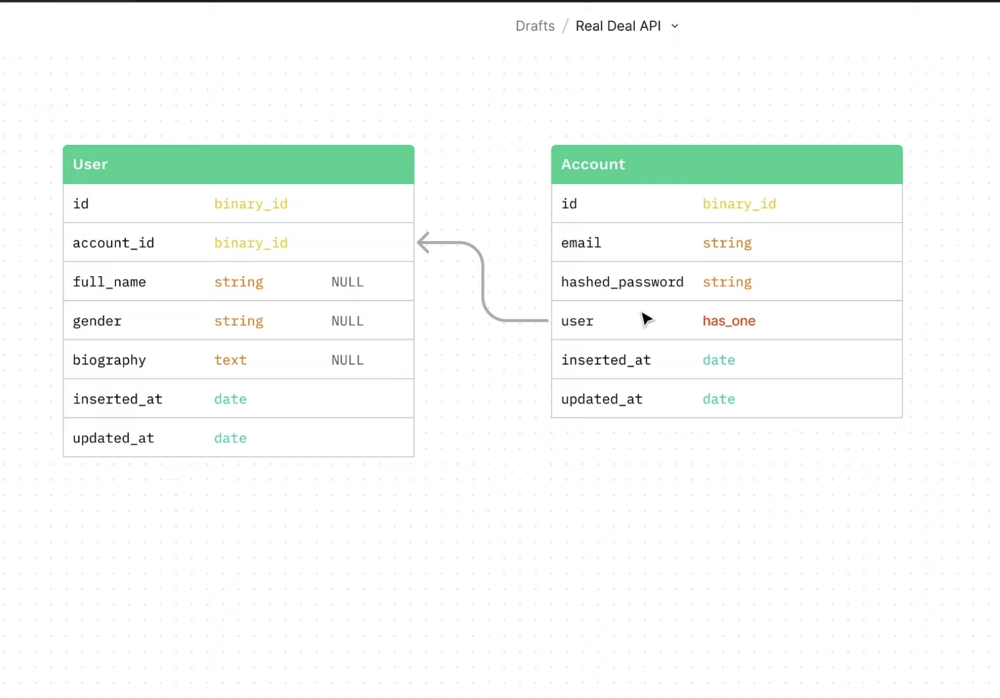

# Our_First_API
## 0.First Endpoint in ELixir:
 * Created basic API and hosted it on localhost 8080.
 * Basic get/, returns OK with status 200
 * Created a get/aliens_name, returns Blork Erlang with status 200
 * Created and ran tests

## 1.Spin up a Postgres Docker Container locally:
 * bs_db created 5500:5432
# Real_Deal_API

## 2. Using Phoenix Framework to Create an Elixir REST API Project:
 * Created a simple endpoint get/api.
 * Created real_deal_api_dev database.
 * Created a phoenix server skeleton code.
	* Key command: **mix phx.new real_deal_api --no-install --app real_deal_api --database postgres --no-live --no-assets --no-html --no-dashboard --no-mailer --binary-id**

 * Started up the server and got: "The Real Deal API is LIVE - dev"
## 3. Using Phoenix Framework to Generate JSON Resources for Elixir REST API Project:
 * Created schemas for `Accounts` and `Users` -> common key `accounts`:
   	* `Accounts`: **mix phx.gen.json Accounts Account accounts email:string hash_password:string**
 	* `Users`: **mix phx.gen.json Users User users account_id:references:accounts full_name:string gender:string biography:text**
